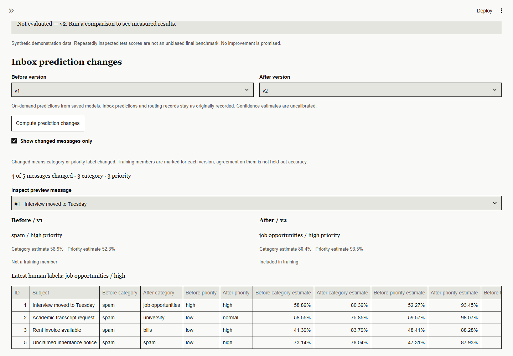
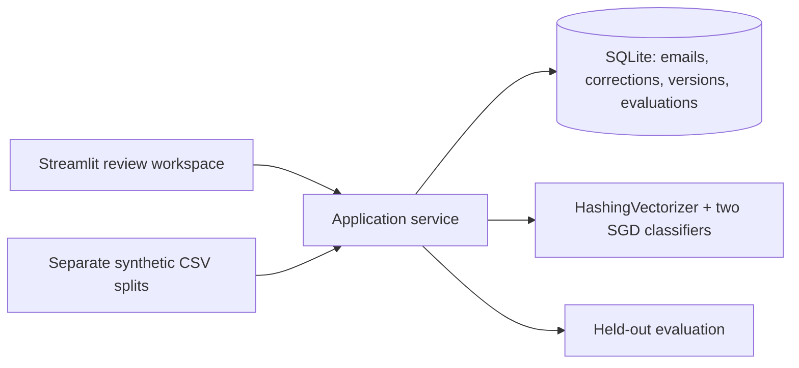

# InboxLearn

**Email triage that learns from human corrections, with reviewable model changes and reversible activation.**

[](https://github.com/sohaib-0897/InboxLearn/actions/workflows/ci.yml)

An email classifier will make mistakes. InboxLearn demonstrates the engineering around those mistakes: efficient human review, traceable feedback, isolated candidate training, evaluation before activation, and rollback. It runs locally with Python, Streamlit, scikit-learn and SQLite.

**Classify → correct → prepare candidate → inspect changes → evaluate → activate → roll back**



*Actual application screenshot using the supplied synthetic messages. Training membership is visible; agreement on those messages is not held-out accuracy.*

[Demo screenshots](docs/screenshots/README.md) · [Measured results](reports/learning.md) · [Project guide](docs/PROJECT_GUIDE.md) · [Portfolio evidence](PORTFOLIO.md)

## What it does

- Classifies CSV emails into five categories and three priorities; low-confidence predictions enter a review queue.
- Puts the least-confident messages first and supports **Save and next**, while retaining original predictions and correction history.
- Learns only from human-confirmed feedback. New labels update the model incrementally; revised labels trigger a rebuild from seed plus the latest corrections.
- Prepares immutable, inactive candidates. Repeated preparation reuses the same candidate; newer corrections are flagged without rewriting it.
- Shows before/after predictions and requires a persisted evaluation on the current held-out dataset before activation. Regressions remain visible, and the user makes the activation decision.
- Preserves earlier models for rollback. Suggested email actions are informational; the application does not send, delete or pay anything.

## Engineering decisions worth reviewing

| Decision | Why it matters | Implementation / evidence |
|---|---|---|
| Separate prediction, correction and activation | A saved correction cannot silently replace the active model | [Application service](inboxlearn/service.py) |
| Immutable snapshots with feedback membership | Each version can be traced to the exact correction revisions it learned | [SQLite repository](inboxlearn/db.py) |
| Transactional candidate deduplication | Concurrent preparation requests do not train the same feedback twice | [Lifecycle tests](tests/test_inboxlearn.py), [candidate tests](tests/test_candidates.py) |
| Evaluation enforced by the service | Calling activation directly cannot bypass the UI gate | [Candidate tests](tests/test_candidates.py) |
| Read-only prediction previews | Reviewers can inspect changes while historical inbox records remain intact | [Preview verification](tests/test_candidates.py) |
| Reproducible experiment in a disposable database | The learning demonstration does not touch the user's inbox | [Experiment](scripts/experiment.py), [isolation test](tests/test_experiment.py) |

The model uses a shared stateless `HashingVectorizer` and separate `SGDClassifier(loss="log_loss")` models for category and priority. The UI uses native Streamlit widgets with a Newsprint theme. No API key, paid model service or external email account is needed.

## Measured demonstration

**Synthetic data only; these results are not a real-world accuracy claim.** The fixed protocol uses 15 seed examples, 5 separate feedback emails, 10 held-out examples and 5 validation examples. All six split pairs have zero normalized subject/body overlap. The validation set was not used for tuning this experiment.

| Metric | Baseline v1 | Evaluated candidate v2 |
|---|---:|---:|
| Category accuracy | 50% (5/10) | 90% (9/10) |
| Category macro-F1 | 0.4222 | 0.8933 |
| Priority accuracy | 30% (3/10) | 80% (8/10) |
| Priority macro-F1 | 0.2222 | 0.6190 |

Candidate preparation left active predictions unchanged. The inbox preview showed changed category or priority labels on **4 of 5 feedback messages**. Rollback restored the exact original predictions and confidence estimates on **15 probes**, including after reopening SQLite.

Remaining errors matter: both held-out **normal-priority messages remained incorrect**, and one of two university messages remained misclassified. The held-out scores have been repeatedly inspected during development; confidence is uncalibrated and feedback can cause regressions. [Full method, limitations and results](reports/learning.md) · [Machine-readable evidence](reports/learning.json)

## Run locally

Requires **Python 3.12**. From a terminal:

```bash
git clone https://github.com/sohaib-0897/InboxLearn.git
cd InboxLearn
python -m venv .venv
```

Windows PowerShell, without changing execution policy:

```powershell
.\.venv\Scripts\python.exe -m pip install -r requirements.txt -c constraints-verified.txt
.\.venv\Scripts\python.exe -m streamlit run app.py
```

macOS / Linux:

```bash
.venv/bin/python -m pip install -r requirements.txt -c constraints-verified.txt
.venv/bin/python -m streamlit run app.py
```

Open **http://localhost:8501**. Use **Classify demonstration sample**, then confirm labels in **Review queue**; the supplied [feedback CSV](data/demo_feedback.csv) contains reference labels. Prepare a candidate in **Train / Versions**, inspect prediction changes and evaluate it in **Evaluation**, then return to activate or roll back.

Uploads require UTF-8 CSV with `subject` and `body`; `sender` is optional. Data stays in `runtime/inboxlearn.sqlite3`, which is excluded from Git. The app binds to localhost and disables Streamlit usage telemetry. [Configuration, CSV rules and detailed walkthrough](docs/PROJECT_GUIDE.md)

## Verification

The local verification completed **30 tests**, an isolated dependency check, and the full Chrome workflow at **1440×1000** and **390×844** viewports. Tests cover actual model updates, revisions, concurrent preparation, evaluation gates, read-only previews, rollback, CSV validation and native UI states through Streamlit AppTest. Browser captures are real and use only synthetic data; mobile checks use a viewport, not a physical phone.

After activating the virtual environment, run:

```bash
python -m pytest -q
python -m pip check
python scripts/experiment.py
```

[GitHub Actions](.github/workflows/ci.yml) runs the tests and dependency check on Windows and Ubuntu and verifies the saved source/evidence archive. [Browser verification and screenshots](docs/screenshots/README.md) includes reproduction instructions; Playwright is an optional QA dependency.

## Architecture



| Location | Responsibility |
|---|---|
| `app.py`, `inboxlearn/presentation.py`, `assets/` | Native widgets, review flow and Newsprint presentation |
| `inboxlearn/service.py`, `inboxlearn/db.py` | Workflow rules, persistence, candidate registry and lineage |
| `inboxlearn/classifier.py`, `inboxlearn/evaluation.py` | Model updates, split isolation, evaluation and validation tuning |
| `tests/` | Service, learning-integrity, experiment and UI checks |
| `reports/`, `docs/screenshots/` | Measured results, reproducible evidence and actual UI captures |

This is a local, single-user portfolio project. Independent real-world evaluation, calibrated confidence, authentication and physical-device accessibility testing remain future work. Model deserialization assumes a trusted local database. Detailed tradeoffs and operational instructions are in the [project guide](docs/PROJECT_GUIDE.md).

Built by [Muhammad Sohaib Imran](https://github.com/sohaib-0897).
