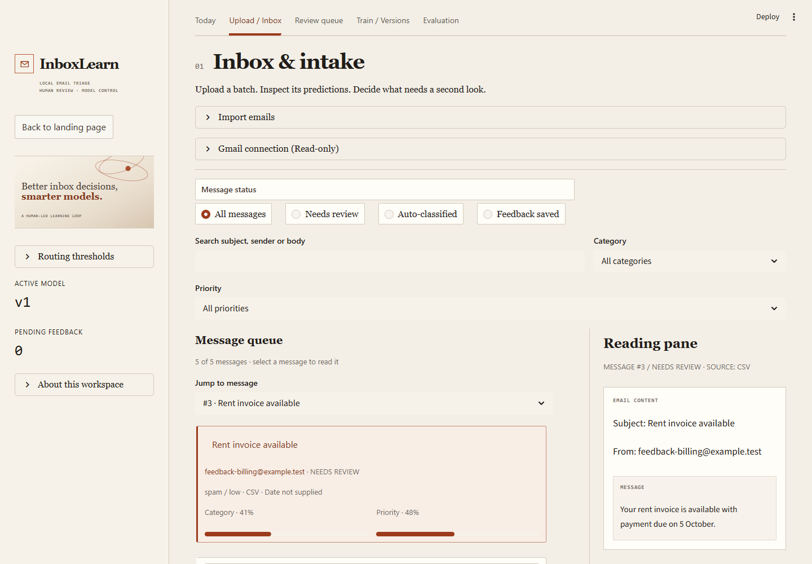
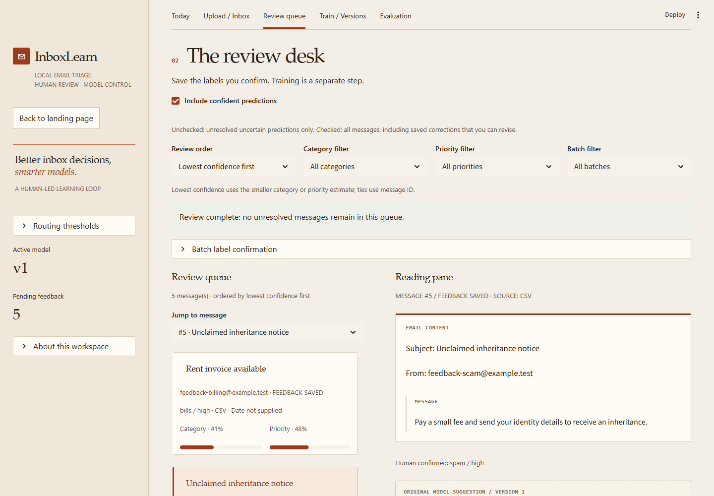
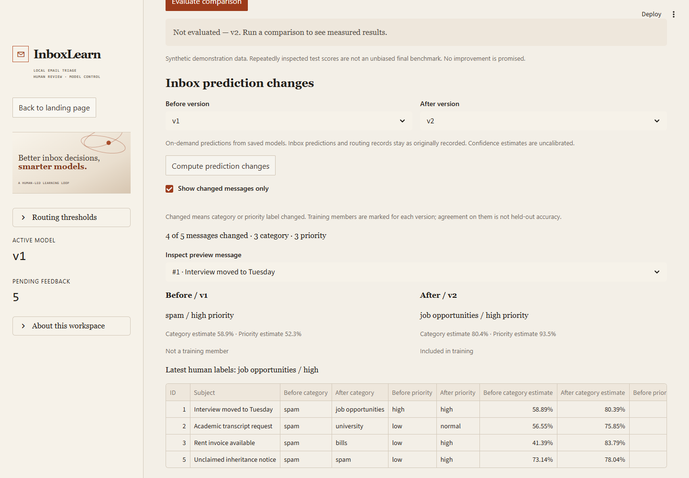
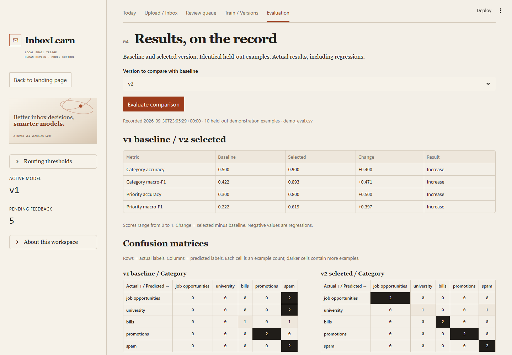
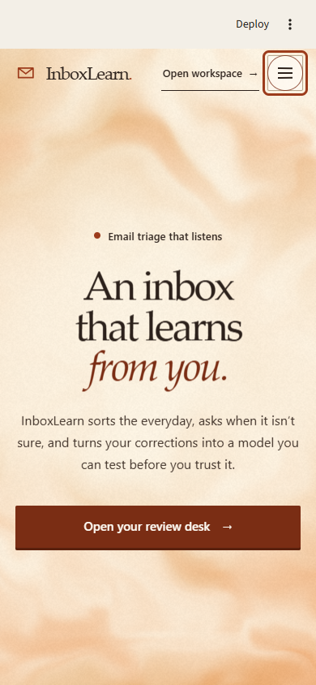
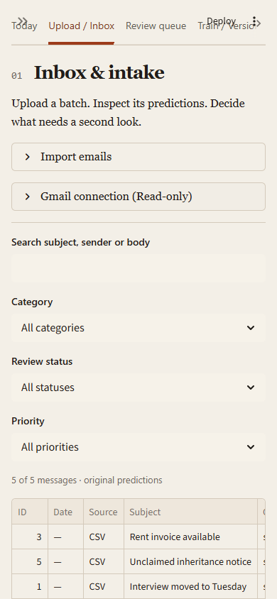
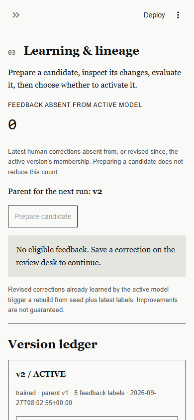
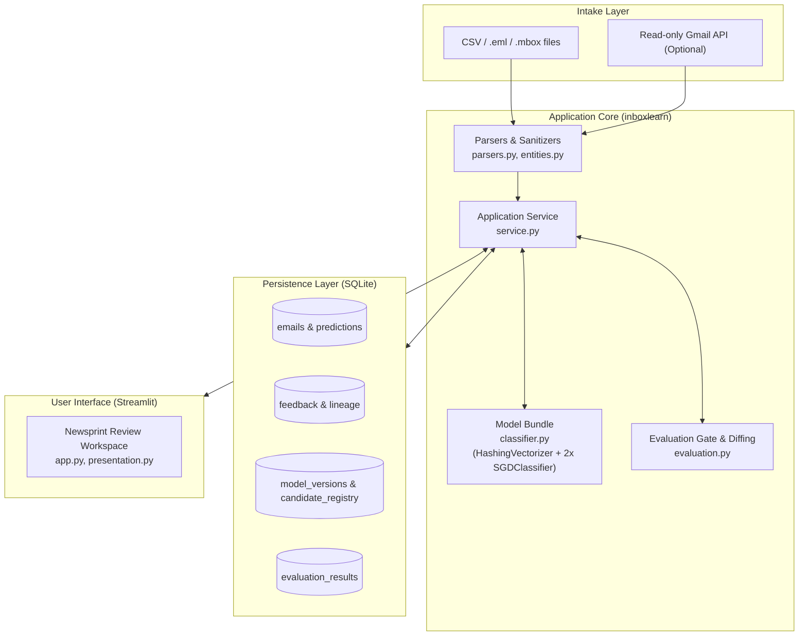

# InboxLearn

A local, human-in-the-loop email triage system featuring incremental linear classification, pre-activation prediction diffing, evaluation-gated candidate models, and reversible version control.

[](https://github.com/sohaib-0897/InboxLearn/actions/workflows/ci.yml)

Production text classifiers inevitably degrade under concept drift and edge-case errors. InboxLearn addresses the engineering lifecycle surrounding those errors: confidence-routed human triage, isolated candidate model training from feedback, side-by-side inbox prediction diffing, and strict evaluation gating before any candidate model can be activated. Core classification and learning run locally using Python, scikit-learn, SQLite, and Streamlit. No paid API is required; the optional Gmail intake is read-only.

## The application and current screenshots

The deployed Streamlit entry point is the root `app.py`. Its default page explains the product; **Open InboxLearn** or `?view=workspace` opens the operational workspace. The Streamlit app uses the existing Python service and SQLite database directly. A separate React client is available in `frontend/` with `/` and `/app` routes through the FastAPI setup.

These current, unedited Chrome captures show the real Streamlit app with the shipped synthetic examples:

<p align="center">
  
</p>
<p align="center">
  
  
</p>
<p align="center">
  
  
</p>
<p align="center">
  
  
  
</p>

The workflow preserves original model suggestions, records human corrections, prepares an inactive candidate, compares predictions, evaluates it on held-out examples, and supports deliberate activation or rollback. Confidence scores are uncalibrated; the evaluation examples and screenshots are synthetic demonstrations. See the [complete desktop/mobile screenshot index and capture details](docs/screenshots/README.md).

## Engineering Highlights

| Problem | Implementation |
|---|---|
| **Silent Deployment Regressions** | Preparing a model creates an inactive snapshot in `model_versions`. Operators inspect an on-demand prediction diff across existing inbox emails before deployment. Training-set membership is explicitly marked to prevent mistaking memorized items for general accuracy. |
| **Bypassing Quality Gates** | The application service enforces candidate evaluation at the Python layer ([`InboxLearnService.activate()`](inboxlearn/service.py)). Activation queries `evaluation_results` in SQLite for a run matching the current held-out dataset hash (`demo_eval.csv`), rejecting direct activations that bypass the UI gate. |
| **Concurrent Retraining Overhead** | Candidate preparation executes within an SQLite write transaction under a threading reentrant lock. Requests are deduplicated in `candidate_registry` using a compound key `(parent_id, seed_hash, feedback_revision_ids, recipe_version)`, returning existing candidate versions when feedback is unchanged. |
| **Feedback Revision Drift** | Unseen human corrections update the active classifier incrementally using `partial_fit` (`incremental_feedback`). When an operator revises a previously trained correction, the service detects the revision and triggers a clean rebuild from seed plus the latest corrections, preventing stale gradient accumulation. |
| **Train/Test Data Leakage** | Pre-training and evaluation routines enforce [`assert_split_isolated()`](inboxlearn/evaluation.py), which normalizes text (NFKC normalization, case-folding, and whitespace collapsing across subject and body) and raises an error on any overlap between training data and held-out evaluation or validation splits, regardless of sender metadata. |
| **Vocabulary Synchronization Drift** | Uses `HashingVectorizer(n_features=4096, ngram_range=(1,2))` with character/word tokens and L2 normalization. Because the feature mapping is purely mathematical and stateless, vocabulary size never expands, eliminating feature misalignment between model iterations. |
| **Arbitrary Code Execution via Deserialization** | Model state persistence uses a safe explicit binary format (`IBL1`) rather than Python `pickle`. Models are reconstructed strictly from validated float64 arrays, class names, and step counters, protected by length bounds, JSON schema checks, and payload SHA-256 digests. Legacy pickle blobs are rejected on load by default; an explicit one-time migration (`migrate_legacy_database(db_path, trusted=True)`) requires intentional operator confirmation. |
| **Model State Reversibility** | Model bundles and metadata are stored as immutable snapshots in SQLite alongside exact feedback record IDs. One-click rollback restores the active pointer to any prior version, immediately returning probe predictions and uncalibrated confidence estimates to their historical values. |
| **Intake Security & Boundary Isolation** | Standard library MIME parsing enforces strict size (5MB EML / 20MB MBOX) and nesting bounds (10 MIME levels), strips HTML to plain text, and skips binary attachments. CSV export neutralizes spreadsheet formula injection (`=`, `+`, `-`, `@`), and sensitive tokens in the optional Gmail connector use Windows DPAPI encryption. |

## Architecture


```mermaid
flowchart TD
    subgraph Intake ["Intake Layer"]
        CSV["CSV / .eml / .mbox files"]
        GMAIL["Read-only Gmail API (Optional)"]
    end

    subgraph Core ["Application Core (inboxlearn)"]
        PARSER["Parsers & Sanitizers<br/>parsers.py, entities.py"]
        SVC["Application Service<br/>service.py"]
        BUNDLE["Model Bundle<br/>classifier.py<br/>(HashingVectorizer + 2x SGDClassifier)"]
        GATE["Evaluation Gate & Diffing<br/>evaluation.py"]
    end

    subgraph Persistence ["Persistence Layer (SQLite)"]
        DB_EMAILS[("emails & predictions")]
        DB_FEEDBACK[("feedback & lineage")]
        DB_MODELS[("model_versions & candidate_registry")]
        DB_EVAL[("evaluation_results")]
    end

    subgraph UI ["User Interface (Streamlit)"]
        APP["Newsprint Review Workspace<br/>app.py, presentation.py"]
    end

    CSV --> PARSER
    GMAIL --> PARSER
    PARSER --> SVC
    SVC <--> Persistence
    SVC <--> BUNDLE
    SVC <--> GATE
    SVC <--> UI
```

| Component | Responsibility | Source |
|---|---|---|
| **Service Layer** | Orchestrates triage, human corrections, candidate preparation, evaluation gating, and rollback | [`inboxlearn/service.py`](inboxlearn/service.py) |
| **Classifier** | Manages stateless hashing feature extraction, safe IBL1 serialization, and incremental SGD learning | [`inboxlearn/classifier.py`](inboxlearn/classifier.py) |
| **Persistence** | SQLite repository managing foreign keys, version lineage, candidate deduplication, and atomic transactions | [`inboxlearn/db.py`](inboxlearn/db.py) |
| **Parsers & Entities** | RFC 822 / MIME intake, bounded extraction, date resolution, and RFC 5545 `.ics` generation | [`inboxlearn/parsers.py`](inboxlearn/parsers.py), [`inboxlearn/entities.py`](inboxlearn/entities.py) |
| **Evaluation** | Held-out metrics, split isolation checks, signed score differences, and confusion matrices | [`inboxlearn/evaluation.py`](inboxlearn/evaluation.py) |
| **Presentation** | Multi-tab Streamlit workspace with the Newsprint editorial theme | [`app.py`](app.py), [`inboxlearn/presentation.py`](inboxlearn/presentation.py) |

## How It Works

The system operates across a seven-stage lifecycle:

1. **Intake & Sanitization**: Incoming emails (from CSV, `.eml`, or `.mbox`) pass through strict size and nesting checks. Text is extracted, HTML is stripped, and metadata (`Date`, `Message-ID`, `In-Reply-To`) is indexed.
2. **Initial Classification**: The active model bundle transforms message text using a stateless `HashingVectorizer(n_features=4096)` and passes features to two independent `SGDClassifier(loss="log_loss")` models predicting 5 categories (`job opportunities`, `university`, `bills`, `promotions`, `spam`) and 3 priorities (`low`, `normal`, `high`).
3. **Confidence Routing**: Predictions where either category confidence or priority confidence falls below the configured threshold (both default to 0.70) are flagged as `needs_review` and routed to the Review queue.
4. **Human Feedback Collection**: Operators inspect flagged messages in the Review Queue. Confirming or revising labels writes immutable records into `feedback` and flags original predictions as `corrected`. Batch confirmations are validated against a checksum token to prevent stale submissions.
5. **Isolated Candidate Preparation**: Clicking **Prepare candidate** initiates training in an exclusive write transaction. If feedback contains revisions to earlier labels, the system rebuilds from the baseline seed plus latest corrections; if all feedback is new, it executes an incremental `partial_fit`. The candidate is stored as an inactive snapshot in `model_versions` (serialized using safe `IBL1` array encoding) and registered in `candidate_registry`.
6. **Pre-Activation Prediction Diffing**: Operators can diff predictions between the active model and the candidate model across stored inbox emails without altering database records. Each email displays a training-set membership flag to distinguish real generalization from training memorization.
7. **Gated Evaluation & Rollback**: The candidate must be evaluated against the separate held-out dataset (`data/demo_eval.csv`). If metrics are acceptable, the operator activates the candidate, removing it from `candidate_registry` and updating the active pointer. If regressions occur in practice, one click rolls back to any earlier version, instantly restoring exact model weights and historical inference outputs.

## Measured Results

> [!NOTE]
> The measurements below are from the repository's synthetic demonstration fixtures and are not a claim of real-world generalization on arbitrary email distributions. Confidence estimates are uncalibrated model outputs intended solely for routing heuristics.

### Historical Benchmark (10 Held-Out Examples)

The fixed demonstration protocol uses 15 synthetic seed examples, 5 feedback corrections, 10 held-out evaluation examples, and 5 validation examples reserved for threshold tuning. All six split pairs have zero normalized content overlap (NFKC, case-folding, collapsed whitespace):

| Metric | Baseline v1 | Evaluated candidate v2 | Absolute change (v2 − v1) | Outcome |
|---|---:|---:|---:|---|
| **Category accuracy** | 50.0% (5/10) | 90.0% (9/10) | +40.0% | Increase |
| **Category macro-F1** | 0.4222 | 0.8933 | +0.4711 | Increase |
| **Priority accuracy** | 30.0% (3/10) | 80.0% (8/10) | +50.0% | Increase |
| **Priority macro-F1** | 0.2222 | 0.6190 | +0.3968 | Increase |

- **Inbox prediction changes**: 4 of 5 feedback messages changed category or priority label when diffed against the candidate model.
- **Rollback precision**: Rolling back to v1 restored identical predicted labels and exact floating-point confidence estimates across all 15 test probes (5 feedback + 10 held-out), including across fresh SQLite connections.
- **Persistent error modes**: Both held-out normal-priority emails remained incorrect after training (0/2 correct), and one university email remained misclassified.
- Full machine-readable evidence: [`reports/learning.json`](reports/learning.json) and [`reports/learning.md`](reports/learning.md).

### Expanded Synthetic Evaluation (25 Scenarios)

To evaluate boundary behavior across broader scenario families, [`data/demo_eval_expanded.csv`](data/demo_eval_expanded.csv) introduces 25 distinct synthetic emails covering ambiguous cases (e.g. fellowship notices, zero-dollar medical bills, promotional invoice upgrades, and fake invoice scams). Split isolation is verified with 0 normalized content overlap against all prior splits:

| Metric | Baseline v1 | Candidate v2 | Absolute change (v2 − v1) | Outcome |
|---|---:|---:|---:|---|
| **Category accuracy** | 32.0% (8/25) | 76.0% (19/25) | +44.0% | Increase |
| **Category macro-F1** | 0.2550 | 0.7428 | +0.4877 | Increase |
| **Priority accuracy** | 36.0% (9/25) | 32.0% (8/25) | -4.0% | Decrease |
| **Priority macro-F1** | 0.2778 | 0.2246 | -0.0532 | Decrease |

**Per-class observations**:
- **Category generalization**: All five categories showed marked F1 improvements from the 5 feedback examples (`job opportunities` 0.0000 → 0.5714, `university` 0.0000 → 0.8000, `bills` 0.5714 → 0.8333, `promotions` 0.3333 → 0.9091, `spam` 0.3704 → 0.6000).
- **Priority sensitivity**: While `high` priority F1 rose from 0.3333 to 0.4516, `normal` priority remained at 0.0000 (0/10 correct) and `low` priority dropped from 0.5000 to 0.2222, demonstrating that small-sample feedback on priority can induce regressions without broader heuristic rules.
- Full per-class metrics: [`reports/expanded_evaluation.md`](reports/expanded_evaluation.md) and [`reports/expanded_evaluation.json`](reports/expanded_evaluation.json).

## Running Locally

### Prerequisites
- Python 3.12+
- Git

### Setup

1. **Clone the repository:**
   ```bash
   git clone https://github.com/sohaib-0897/InboxLearn.git
   cd InboxLearn
   ```

2. **Create and activate a virtual environment:**
   - Windows PowerShell:
     ```powershell
     python -m venv .venv
     .\.venv\Scripts\Activate.ps1
     ```
   - macOS / Linux:
     ```bash
     python3 -m venv .venv
     source .venv/bin/activate
     ```

3. **Install verified dependencies:**
   ```bash
   pip install -r requirements.txt -c constraints-verified.txt
   pip install fastapi uvicorn httpx python-multipart
   ```

4. **Launch Options:**

   #### Option A: FastAPI API and React app (production)
   Run the production API server (serves the REST API and the compiled React + Three.js application simultaneously at `http://127.0.0.1:8000`):
   ```bash
   python scripts/serve_api.py 8000
   ```
   Open **http://127.0.0.1:8000** in your browser. API docs are available at **http://127.0.0.1:8000/docs**.

   #### Option B: Frontend Hot-Reload Development (Vite + React)
   In a separate terminal, install npm dependencies and launch the Vite development server:
   ```bash
   cd frontend
   npm install
   npm run dev
   ```
   Open **http://localhost:5173** in your browser. The Vite server automatically proxies `/api/*` to the FastAPI backend at port 8000.

   #### Option C: Native Newsprint Streamlit app
   ```bash
   streamlit run app.py
   ```
   Open **http://localhost:8501** in your browser. Select **Open InboxLearn** to access the workspace, or navigate directly to **http://localhost:8501/?view=workspace**. For hosted Streamlit, use the repository-root `app.py` entry point; it runs the Python service directly and does not need the FastAPI/Vite setup.

### Demonstration walkthrough

1. Open **Upload / Inbox** and import a CSV, `.eml`, or `.mbox` file, or classify the supplied demonstration sample.
2. In **Review queue**, inspect the original suggestion and confidence, confirm category and priority, then choose **Save human correction** or **Save and next**.
3. In **Train / Versions**, prepare an inactive candidate. The active model stays in use.
4. In **Evaluation**, inspect the read-only prediction changes, then evaluate the candidate on the separate held-out dataset.
5. Return to **Train / Versions** to activate the evaluated candidate or roll back to an earlier version.

## Testing

All tests run locally without network access or third-party service credentials:

```bash
python -m pytest -q
```

Test suite coverage:
- **157 passed tests** in the latest recorded run across 13 test modules in `tests/`:
  - `test_model_security.py`: Safe `IBL1` serialization, header/checksum verification, corrupted blobs, shape mismatches, oversized payloads, non-finite values, legacy pickle rejection, trusted migration, and rollback.
  - `test_candidates.py`: Candidate preparation, evaluation gating, rollback, and deduplication.
  - `test_learning_integrity.py`: Split isolation, content-leakage prevention, and email-content joins.
  - `test_inboxlearn.py`: Core service lifecycle, concurrent training locks, CSV validation, and formula escaping.
  - `test_parsers.py`: MIME parsing, HTML sanitization, multipart extraction, and size/depth bounds.
  - `test_entities.py`: Regex entity extraction, relative date anchoring, and currency matching.
  - `test_calendar.py`: RFC 5545 compliance, line-folding ($\le 75$ octets), and timezone handling.
  - `test_db_migration.py`: Additive SQLite migrations on pre-populated databases.
  - `test_gmail.py`: Read-only OAuth PKCE flow, loopback callbacks, token encryption, and sync error paths.
  - `test_daily_workspace.py`: Follow-up scheduling, status transitions, and history queries.
  - `test_ui.py`: Streamlit `AppTest` automated interface tests covering all tab interactions.
  - `test_landing.py`: Product overview rendering and workspace routing.
  - `test_experiment.py`: Deterministic experiment reproduction in isolated temporary databases.

Additional quality checks:
```bash
# Verify dependency consistency
python -m pip check

# Run reproduction benchmark (historical 10-example set)
python scripts/experiment.py

# Run expanded evaluation (25 diverse scenarios)
python scripts/evaluate_expanded.py

# Optional: Run Playwright browser QA (requires Chrome)
pip install playwright
python scripts/browser_qa.py --portfolio
```

## Repository Structure

```text
├── app.py                     # Streamlit application entry point
├── inboxlearn/                # Core Python package
│   ├── classifier.py          # Safe IBL1 serialization & SGDClassifier bundle
│   ├── service.py             # Application service & workflow coordinator
│   ├── db.py                  # SQLite schema, migrations, and transactions
│   ├── parsers.py             # RFC 822 / MIME / CSV intake parsers
│   ├── entities.py            # Regex entity & deadline extraction
│   ├── calendar_export.py     # RFC 5545 .ics generator
│   ├── evaluation.py          # Metrics calculation & split isolation checks
│   └── gmail.py               # Read-only Gmail OAuth connector (optional)
├── data/                      # Synthetic CSV splits (seed, feedback, eval, validation, eval_expanded)
├── tests/                     # 13 test modules (157 automated unit/integration/UI/security tests in the latest recorded run)
├── scripts/                   # Evaluation benchmarks, browser QA, and packaging scripts
├── docs/                      # Technical documentation & current UI screenshots
│   ├── PROJECT_GUIDE.md       # Detailed architectural and operational guide
│   └── screenshots/           # Desktop and mobile UI captures with capture.json metadata
└── reports/                   # Machine-readable evaluation results (JSON & Markdown)
```

## Limitations

- **Synthetic evaluation data**: The recorded metrics reflect the repository's synthetic demonstration fixtures only; real-world accuracy on natural, multi-domain personal or corporate email has not been benchmarked.
- **Repeated inspection of held-out split**: The historical 10-example held-out evaluation set was inspected repeatedly during development and should not be treated as an unbiased benchmark. The validation split (`data/demo_validation.csv`) is reserved for threshold tuning.
- **Uncalibrated confidence**: Class probabilities produced by `SGDClassifier(loss="log_loss")` are uncalibrated and intended solely for review queue threshold routing.
- **Priority sensitivity on broader distributions**: Evaluation on expanded scenarios demonstrates that while category classification generalizes effectively from small feedback batches, priority accuracy can slightly regress (-4.0%) without explicit rule heuristics or larger priority-balanced corpora.
- **Exact-match split isolation**: Split isolation uses normalized text hashing (NFKC, lowercase, whitespace-collapsed); it does not detect semantic paraphrases across splits.
- **Single-user local environment**: SQLite transactions with threading locks support single-process desktop usage; the repository does not implement multi-tenant authentication, distributed queues, or horizontal worker scaling.
- **Model persistence boundary**: Model serialization uses the explicit `IBL1` binary format with strict shape and checksum verification, eliminating Python `pickle` execution vulnerabilities. Legacy databases containing pickle blobs must be migrated explicitly using `migrate_legacy_database(..., trusted=True)`.
- **Strictly read-only scope**: InboxLearn cannot send emails, create drafts, delete messages, or alter remote mailbox states.

## License

No explicit license file is currently provided. All rights reserved by the author.
