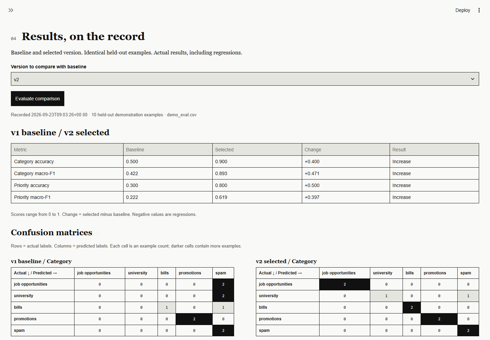
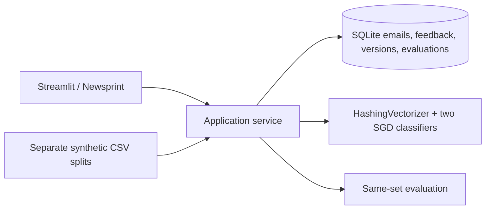

# InboxLearn project guide

[Back to the project overview](../README.md)

InboxLearn is a small local Streamlit app and self learning AI agent for human-in-the-loop email classification. It uses Python, SQLite, scikit-learn, and no paid APIs, Gmail integration, sending, deletion, payment, or other external calls.

The agent predicts five categories (`job opportunities`, `university`, `bills`, `promotions`, `spam`) and three priorities (`low`, `normal`, `high`). It stores the original prediction, uncalibrated confidence estimates, model version, corrections, training lineage, and evaluation results in SQLite. A prediction enters review when either confidence estimate is below its configurable threshold. Suggested next actions are informational only.

[Measured experiment](../reports/learning.md) · [Full results](../reports/learning.json) · [Portfolio / CV bullets](../PORTFOLIO.md) · [Real screenshots](screenshots/README.md)

## Reproduce the learning experiment

After setup, run one command from the project root:

```powershell
.\.venv\Scripts\python.exe scripts\experiment.py
```

It creates a new temporary SQLite database under `runtime/experiments/`, ignores `INBOXLEARN_DB`, runs the actual application services, and removes that temporary database. It writes `reports/learning.json` and `reports/learning.md`. The user's database and active model are never opened by this command. Tests repeat the experiment and verify that a separate caller database remains byte-for-byte unchanged.

The fixed protocol uses **15 synthetic seed examples**, **5 separate pre-authored feedback examples**, **10 identical held-out examples** for both versions, and **5 separate validation examples** checked for isolation but not used for tuning. All six pairs of splits have zero normalized subject/body overlap (NFKC, case folding and collapsed whitespace, ignoring sender). No model predictions or evaluation labels enter feedback training; fixture labels are replayed through the same `save_feedback` API used by the review UI. No dataset, hyperparameter or threshold was changed in response to these scores.

| Metric | Baseline v1 | Updated v2 | Absolute change (v2 − v1) |
|---|---:|---:|---:|
| Category accuracy | 0.5000 (5/10) | 0.9000 (9/10) | +0.4000 |
| Category macro-F1 | 0.4222 | 0.8933 | +0.4711 |
| Priority accuracy | 0.3000 (3/10) | 0.8000 (8/10) | +0.5000 |
| Priority macro-F1 | 0.2222 | 0.6190 | +0.3968 |

Changes are signed differences on a 0–1 scale: accuracy increased by 40 and 50 percentage points, respectively. These are **synthetic demonstration results**, not real-world accuracy estimates. All four aggregate metrics increased in this fixed run; there were no aggregate regressions. Still, **normal priority remained 0/2 correct**, and the updated model misclassified **one of two university emails**. The dashboard and experiment report retain regressions whenever measured; learning does not guarantee improvement.

Both classifiers consumed exactly five new feedback examples and their coefficients changed. Preparing v2 left v1 active; repeating preparation returned the same candidate. Activation was rejected before evaluation. After evaluation and explicit activation, repeated training was a no-op. Rollback restored v1's exact predictions **and confidence estimates on all 15 probes** (5 feedback + 10 held-out) after reopening SQLite; its stored model bytes also matched. JSON records class counts, confusion matrices, inbox prediction changes, training membership, fixture/source hashes and dependency versions.



## Windows PowerShell setup

```powershell
py -3.12 -m venv .venv
.\.venv\Scripts\Activate.ps1
python -m pip install -r requirements.txt
python -m streamlit run app.py
```

If PowerShell blocks activation for the current process, run `Set-ExecutionPolicy -Scope Process Bypass` and activate again. The default runtime database is `runtime\inboxlearn.sqlite3`; set `$env:INBOXLEARN_DB` to use another local path.

For an isolated setup without activation, run from the extracted project directory. Create `.venv` once (use a fresh extraction for a completely fresh environment):

```powershell
py -3.12 -m venv .venv
.\.venv\Scripts\python.exe -m pip install -r requirements.txt
.\.venv\Scripts\python.exe -m pip check
.\.venv\Scripts\python.exe -m pytest -q
.\.venv\Scripts\python.exe -m streamlit run app.py
```

The `.venv` directory is local-only and is excluded from `InboxLearn.zip`.

For the direct and numerical dependency versions used by the saved experiment, install with `python -m pip install -r requirements.txt -c constraints-verified.txt` inside the environment. Recorded Python version: 3.12.9. The constraints file is not a complete transitive dependency lock; exact numerical compatibility across other versions/platforms is not promised. No global packages or `aisuite` are needed.

The Newsprint UI requires Streamlit 1.63 or newer, as declared in `requirements.txt`, for the supported theme options and stateful native tabs. The server binds to `127.0.0.1` and usage telemetry is disabled in `.streamlit/config.toml`. Open `http://localhost:8501` after starting it.

## Newsprint workspace

The UI uses warm paper, black rules, sharp native controls, serif headings and a static status strip. Tokens live in `assets/newsprint.css` and the native widget theme in `.streamlit/config.toml`. Local Playfair Display, Lora, Inter and JetBrains Mono are used when installed; Georgia, Arial and Consolas/monospace provide offline fallbacks. No remote fonts or custom frontend are needed.

- **Emails stored** counts all unique imported emails.
- **Pending reviews** counts unresolved messages originally routed as uncertain.
- **Available feedback** counts latest corrections absent from the active model, once per email. A prepared candidate may already include them; its ledger reports that separately.
- **Active version** is used for future classification and as the parent of the next training run.

Search and category/status filters narrow the inbox table. Message selectors show ID and subject preview. The review desk defaults to **Lowest confidence first**, using the smaller category/priority estimate with ascending ID as the tie-breaker; **Newest first** is also available. **Include confident predictions** exposes all messages and correction history. **Save human correction** records feedback; **Save and next** moves to the next unresolved message only after a successful save and announces completion when the queue is exhausted. Failed saves retain the selected message and form values.

**Prepare candidate** saves an inactive model snapshot separately. The active model continues classifying new imports. Repeat preparation returns the same candidate for the same parent, seed, feedback revisions and recipe. The ledger shows each candidate's included corrections and warns when newer corrections are omitted. Evaluate before choosing **Activate**; **Roll back to** restores an earlier available model. Counts and tab selection remain current after reruns.

Evaluation displays only the selected version's persisted comparison against the current held-out dataset hash, including its labels. Unevaluated versions say **Not evaluated**. Accuracy, macro-F1, signed changes and explicit regression labels accompany four monochrome confusion matrices (baseline/selected, category/priority). The candidate ledger reports regressions relative to baseline and parent before activation; regressions do not prevent your decision to activate. Sidebar threshold changes affect future imports, not historical routing records.

**Inbox prediction changes** computes a read-only comparison on demand, defaulting to the prepared candidate and its parent. A per-message comparison places the two versions side by side on desktop and stacks them on mobile. The table shows before/after categories, priorities, uncalibrated confidence estimates, latest human labels, training membership and changed-label counts. Only changed messages are shown by default; uncheck **Show changed messages only** to include all messages. Version, email and correction changes invalidate the preview. Agreement on training members is not held-out accuracy. Original inbox predictions remain intact.

## Demo

1. Open the local Streamlit URL and use **Upload / Inbox**.
2. Expand **Import CSV / demonstration files** and download `demo_feedback.csv`, upload it, or use **Classify demonstration sample**. Its labels are reference material only: classification never saves feedback automatically. Keep `demo_eval.csv` reserved for held-out evaluation.
3. Open **Review queue**, inspect the inert text, and confirm category and priority with **Save and next**. Include confident predictions to review all five examples.
4. Open **Train / Versions** and **Prepare candidate**. New feedback is added incrementally. Corrections revised after learning trigger a rebuild from seed plus the latest labels. The current active version stays in use.
5. Open **Evaluation** and **Compute prediction changes** to inspect the candidate against its parent. These inbox examples may be training members; their agreement is not an accuracy benchmark.
6. Use **Evaluate comparison** to inspect accuracy, macro-F1 and confusion matrices on the same held-out `data\demo_eval.csv`. Actual regressions are shown and the result is persisted.
7. Return to **Train / Versions**, inspect the measured results, and choose **Activate** if desired. Activation requires an evaluation matching the current held-out dataset; this is enforced by the service as well as the UI.
8. Use **Roll back to** on an older version. Further training creates a child of the rolled-back parent; a previously activated candidate is never reused by preparation.

The files in `data/` are demonstration data: `demo_seed.csv` is the fixed synthetic seed, `demo_validation.csv` is reserved for tuning experiments, `demo_feedback.csv` contains example human feedback, and `demo_eval.csv` is the separate held-out evaluation set. They contain only `example.test` addresses. Validation is for model or threshold tuning; repeatedly inspecting held-out scores is not an unbiased final benchmark.

## CSV rules

Uploads must be UTF-8 CSV, no larger than 5 MiB, with at most 1,000 rows. `subject` and `body` are required and cannot be empty; `sender` is optional. Normalized duplicate content is rejected. Labeled demo/evaluation files additionally require valid `category` and `priority` fields. Exported values beginning with spreadsheet formula characters are prefixed with an apostrophe.

## Design notes

Each target has its own `SGDClassifier` with `log_loss` and a shared stateless `HashingVectorizer`. Only the fixed demonstration seed and human-confirmed latest labels are used for training; agent predictions are never training labels. SQLite write transactions hold the training lock through model construction and version insertion, so a partial model version cannot be committed. Version records contain immutable metadata, parent version, dependency versions, serialized model state, feedback membership, and training lineage.

Each new correction is joined to its email subject, body and sender before feature extraction. Feedback already present in the active version is not applied again; revised feedback triggers a rebuild using seed plus only the latest labels. `train()` returns an inactive candidate's version information (or `None` when nothing is absent from the active model). `compare_versions(id)` persists evaluation; `activate(id)` applies the evaluation gate and changes the active pointer, preserving model bytes. `rollback(id)` uses the same gate for candidates, so it cannot bypass evaluation.

An additive `candidate_registry` table deduplicates preparation inside the existing SQLite training transaction, keyed by parent version, seed hash, latest feedback revision IDs and training recipe version. Activation removes that registry entry atomically. Baseline creation still activates v1. Historical versions and previously activated rollback targets remain available without retroactive evaluation requirements. Existing model blobs and predictions are not migrated or rewritten. A stale candidate remains an immutable snapshot; preparing again includes newer corrections.

Verification fixed a missing feedback/email join: previously the service passed labels without their content to the trainer. A regression test now compares real service coefficients with an independent update using the actual email text. Missing training content is rejected. Pre-training checks also reject normalized content overlap with held-out or validation data, even if sender metadata changes. Model settings and fixture files were preserved; existing user versions are not rewritten. Use the isolated experiment for the corrected reference results.

SQLite connections are explicitly closed, and model construction/version insertion runs under one write transaction. Scores can regress after feedback, so the dashboard reports measured values without promising improvement. Confidence is an uncalibrated model estimate and is only used for routing to review.

## Architecture



`app.py` and `inboxlearn/presentation.py` handle native widgets and presentation. `service.py` coordinates the workflow; `db.py` persists state and version lineage; `classifier.py` provides the shared stateless vectorizer and separate `SGDClassifier(loss="log_loss")` models. `validation.py` validates CSVs and normalized content; `evaluation.py` computes accuracy, macro-F1 and confusion matrices. `scripts/experiment.py` uses these services with a disposable database, while `scripts/browser_qa.py` drives the actual UI.

## Limitations

- The small English-language data is synthetic. Replayed fixture labels are not a real-user study; generalization is unverified.
- Confidence is uncalibrated. Feedback can degrade predictions; both normal-priority held-out emails are still wrong in the recorded run.
- The held-out set has been repeatedly inspected during development, so it is not an unbiased final benchmark. Use validation for tuning and new independent data for a final benchmark.
- Normalized exact-match isolation does not detect semantic paraphrases. This is a local, single-user demonstration, not an authenticated multi-user service.
- Actions are suggestions only: no sending, deletion, payments or external integration. Model deserialization assumes a trusted local database and compatible dependencies.

## Tests

Run:

```powershell
python -m pytest -q
```

The tests cover candidate persistence, concurrent preparation deduplication, unchanged active predictions, current-dataset evaluation gating, activation, revisions, additive migration, rollback/retraining, and read-only preview counts against direct model predictions. They also cover content-based updates, split isolation, CSV validation, export safety, experiment reproducibility and user-database isolation. AppTest exercises review sorting, save-and-next completion, failed saves, candidate states, preview invalidation, evaluation, activation and rollback; because AppTest has no upload driver, that test adapts only the file-upload boundary with actual CSV bytes.

Optional real-browser checks (Chrome must already be installed):

```powershell
.\.venv\Scripts\python.exe -m pip install playwright
.\.venv\Scripts\python.exe scripts\browser_qa.py
.\.venv\Scripts\python.exe scripts\browser_qa.py --portfolio
```

The script starts and stops separate isolated Streamlit servers and synthetic databases for desktop and mobile Chrome. Each viewport completes classify → correct → prepare → inspect changes → evaluate → activate → roll back → reactivate using native widgets. It also checks startup health, keyboard focus, dropdowns and overflow. The optional `--portfolio` run verifies scores and previews against the saved experiment and copies curated synthetic screenshots and capture metadata into `docs/screenshots/`; runtime databases/logs remain excluded. Run `scripts/experiment.py` first. Playwright is an optional QA tool, not an app dependency.

Rebuild and verify the source-only archive:

```powershell
.\.venv\Scripts\python.exe scripts\package.py
```

Packaging uses an explicit allowlist for source, synthetic fixtures, measured reports and curated screenshots. It includes the GitHub Actions workflow, `.streamlit/config.toml` and the stylesheet, validates archived files against source, and excludes environments, private emails, runtime data, caches and model binaries. The `.gitignore` keeps runtime files, arbitrary CSVs and the generated ZIP out of Git. `.gitattributes` preserves LF line endings so evidence hashes remain stable across platforms.

Verified locally on Windows / Python 3.12.9 with Streamlit 1.63.0: `30 passed` in pytest (including AppTest and the repeatability/isolation experiment), and isolated `pip check` reported no broken requirements. The [CI workflow](../.github/workflows/ci.yml) checks tests, dependencies and the source/evidence archive on Windows and Ubuntu. Browser verification details and screenshot provenance are recorded in [capture.json](screenshots/capture.json). Mobile checks use a Chrome viewport, not a physical phone. Other browsers, screen readers and real-world generalization remain unverified.
